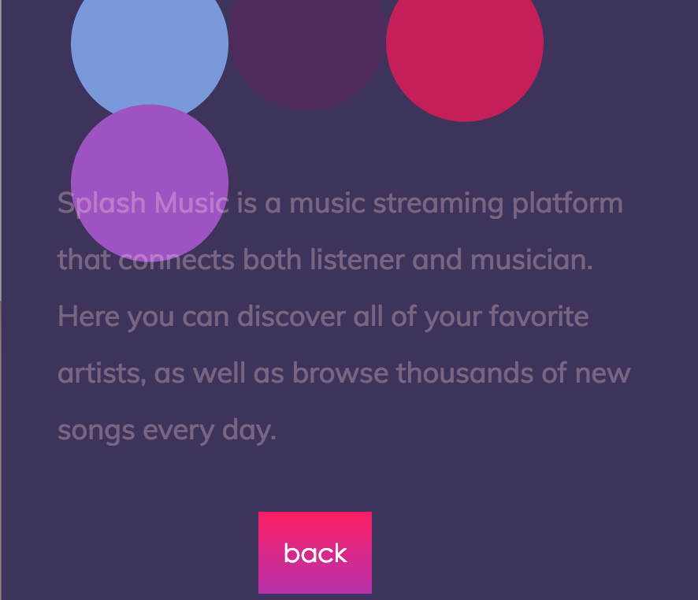

# Splash Music
## A project for Web + Mobile Systems Design
### Master's in Digital Futures at OCAD University, June 2018

This project is intended to display a collection of web animations using Anime.js and CSS hover effects, presented in a fictitious music streaming splatform. The brand is colorful and playful, and thus allows the space for web animations.

### Creation process

I started initially by exploring Anime.js (a Javascript library for animation) and its functionality, which is available [here](http://animejs.com "Anime"). I actually found that the documentation they have on their website wasn't as helpful as the codepen examples, since I am still fairly unfamiliar with Javascript and a lot of their documentation perpetuated the assumption that I understood more of what they were talking about than I actually did. SO, what ultimately got me to start getting the hang of it was to go through demos of what other (more experienced) developers had created using this library and to figure out how to repurpose them for this site. 

I knew from the beginning that I was interested in having interactive and engaging animations, rather than looped, so this was something that I was looking for in order to create this effect of a "real" website.

Therefore, I'd like to thank the codepen authors: Te Vallee, Alex Zaworski, and: whoever made the line drawing example that allowed me to figure out how to create the line drawing effect on the logotype (can't find that source anymore).

#### Some hiccups

1. Getting all of the elements on the page to be viewed on top of each other, rather than stacked separately on the page. This was especially a problem with the interactive splashy canvas on the homepage, which refused to go in the background until I experimented with some positioning and z-indexs that allowed it to be pushed to the back. I eventually had to wrap all of the content not within the canvas into a div class="body" which I could then position accordingly. 

2. I also had trouble understanding how to get the SVG logotype to be responsive. 
It initially was too small, and the way that I *thought* I solved that was to get rid of this viewPort line of code that I thought wasn't doing anything; however, lo and behold, later (when I'm testing responsiveness) I realize that the viewPort is actually what allows the SVG to be scalable (as long as its width is set to 100%.) Below is a snapshot of the SVG being way too big.

3. I also had some trouble with the positioning on the content page, with a similar solution of experimenting with positioning and z-index. Content page was fun editing the code for the game animation loop, and making it look totally different but with the same foundational code!

4. Finally, media queries... 

Big lesson learned here: I was testing all of this on my desktop browser and just scaling the width of the window, but when I tested on my phone it suddenly became super-tiny on my screen. FUN FACT, I was missing this line of code in my html files: meta name="viewport" content="width=device-width, initial-scale=1.0"

APPARENTLY, this is super important!
